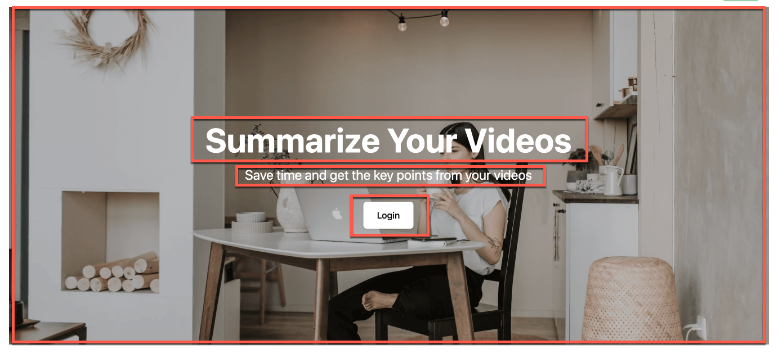
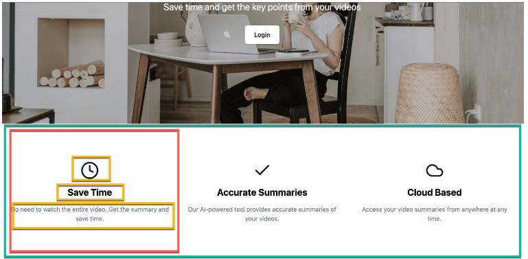

# Đọc Phần Tóm Tắt Video Của YTB

## 1. Tổng quan

- Dùng để tra cứu phần tóm tắt của video trên ytb để quyết định xem có nên xem video đó khong
- Công nghệ sử dụng Strapi V5 + NextJs 14

## 2. Khởi động dự án

B1: Install project về

- Nextjs
- Strapi

B2: Khởi động project

- Nextjs, sử dụng các lệnh terminal dưới tương ứng với loại chúng ta cài đặt, [http://localhost:3000](http://localhost:3000)

```bash
npm run dev
# or
yarn dev
# or
pnpm dev
# or
bun dev
```

- Strapi, sử dụng các lệnh terminal dưới tương ứng với loại chúng ta cài đặt, [http://localhost:1337](http://localhost:1337)

```bash
npm run develop
# or
npm run develop --no-watch-admin
```

## 3. Code

- Code strapi sẽ gồm các bước: collection type, component, dynamic zone
- Trong phạm vi dự án này các trang sẽ đại diện là collection type, mỗi trang sẽ chứa các section component bên trong gọi là layout, các section này sẽ chứa các components con
- Giao diện homepage nó bao gồm hero section + feature section + header + footer
  - Là 1 phần của homepage thế nên việc đầu tiên là phải tạo collection type cho homepage
  - Homepage sẽ chứa các dynamic zone bên trong như component hero section, feature section,...
  - Các component như hero section sẽ chứa các layout component bên trong

### 3.1 Hero section



Giao diện hero section là một component chứa 4 phần: image + heading + subheading + component cho nút button

- B1: Tạo component hero section đặt tên là layout
  - display name (Hero Section) + select a category (nếu chưa có layout trong dự án thì đặt tên là layout)
  - Tạo các field image + heading + subheading + button
- B2: Button sẽ bao gồm tên + link => tạo nó là một component
  - display name (Link) + select a category (nếu chưa có layout trong dự án thì đặt tên là components)
- B3: Thêm link vào trong hero section
  - chọn add field component > sau đó chọn component đã có sẵn > chọn components link đã tạo ở trên, coi cách tạo [ở đây](https://www.youtube.com/watch?v=fZ0D0cnR88E&t=1187s)
- B4: Thêm layout hero section vào home page
  - Tạo dynamic zone đặt tên là blocks > chọn component có sẵn > chọn hero section, coi cách tạo [ở đây](https://youtu.be/fZ0D0cnR88E?t=1284)

### 3.2 Feature section



Giao diện feature section là một component chứa 3 phần: title + description + component cho 1 ô

- B1: Tạo component feature section nằm trong layout
- B2: Tạo component feature nằm trong components
  - Do nó lặp đi lặp lại nên mục **configure the component** ta chọn repeatable component
  - Icon ở đây nó giá trị fix cứng nên ta tạo các enum đại diện cho nó
- B3: Thêm feature vào trong feature section
- B4: Thêm layout feature section vào home page
  - Coi cách tạo [ở đây](https://youtu.be/fZ0D0cnR88E?t=2619)

Video xây dựng project trên [ở đây](https://www.youtube.com/watch?v=fZ0D0cnR88E)

## 4. Một vài lưu ý
